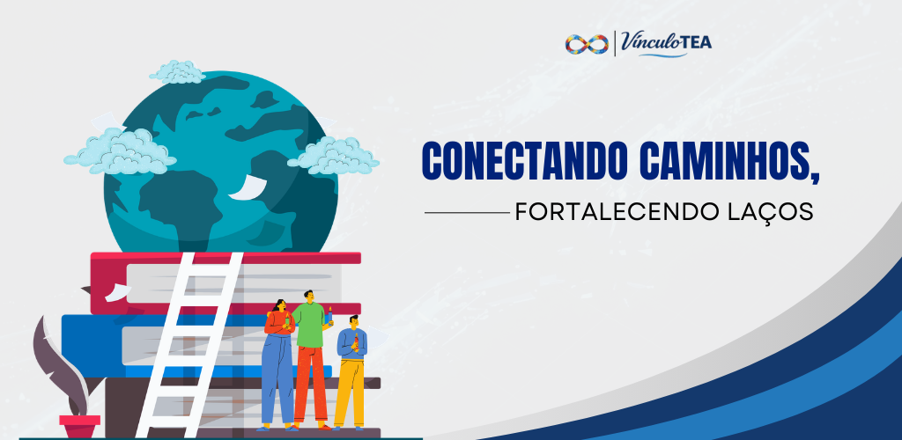

   <h1 align="center">
       VinculoTEA
    <br />
    <br />
    <a href="https://github.com/StellaKarolinaNunes/VinculoTEA">
     
    </a>
  </h1>

</div>

<p align="center">
  
  
  
  
  
  
</p>

---

> **Documentação de Deploy**: Para configurar e visualizar a documentação do projeto localmente, siga o guia de deploy disponível na seção [Documentação de Deploy](#documentação-de-deploy). Nela você encontrará os passos para instalar o Mintlify, executar o ambiente de documentação e acessar a interface no navegador.


---

##  Introdução
**VinculoTEA** é uma plataforma de gestão multidisciplinar para educação inclusiva, desenvolvida para facilitar a comunicação e o acompanhamento de alunos com Transtorno do Espectro Autista (TEA). O aplicativo utiliza uma interface multimodal com vídeos em Libras e fluxos intuitivos, garantindo autonomia ao aluno e clareza diagnóstica para os profissionais de saúde. Esta documentação fornece detalhes sobre o funcionamento, instalação e diretrizes do projeto.


<br>

## Por que VinculoTEA?
A educação inclusiva é um direito fundamental, mas para alunos com Transtorno do Espectro Autista (TEA), o ambiente escolar muitas vezes se torna um espaço de exclusão. Na ausência de ferramentas acessíveis durante a triagem, o aluno é forçado a enfrentar o ruído clínico e a perda de sua autonomia. Essa falha de comunicação não apenas gera ansiedade e isolamento, mas escala para riscos reais: diagnósticos imprecisos e atrasos críticos no atendimento que podem comprometer desfechos clínicos.

<br>

## A Solução
 
*  **Prontuário Centralizado** | Histórico clínico e pedagógico unificado por aluno 
*  **PEI Automatizado** | Criação assistida com wizard de múltiplas etapas e validação integrada 
*  **Central de Relatórios** | Dashboards com estatísticas em tempo real por aluno, profissional e escola 
*  **Agenda Integrada** | Agendamento e acompanhamento de atendimentos multidisciplinares 
*  **Gestão Administrativa** | Gerenciamento completo de escolas, turmas e profissionais 
*  **Controle de Acesso** | RBAC granular com isolamento total via Plataforma_ID (Multi-tenancy) 
 
 <br>
 
 ## Planos e Precificação (SaaS)
 
 O **VínculoTEA** foi desenhado para escalar de profissionais autônomos a grandes redes de ensino:
 
 *   **Plano Essencial**: Focado em profissionais independentes (psicólogos, fonoaudiólogos).
 *   **Plano Institucional**: Gestão completa para escolas e clínicas multidisciplinares.
 *   **Plano Redes (Enterprise)**: Visão consolidada para secretarias de educação e grandes grupos.

 >  **Fluxograma do Projeto**: Caso queira entender a lógica de navegação e processos do aplicativo, acesse o arquivo [fluxograma/FLUXOGRAMA.md](fluxograma/FLUXOGRAMA.md).

 <br>

 ## Funcionalidades Principais

#### * Gestão de Alunos
- Cadastro completo com dados pessoais, CID, gênero e detalhes clínicos
- Vinculação com família, escola e turma
- Upload de foto e documentação
- Histórico de PEIs e acompanhamentos

#### * Gestão de Alunos & PEI
- **Student Registration Wizard**: Processo guiado de múltiplas etapas para novos cadastros (Dados, Família, Escola/Saúde).
- **Wizard de PEI**: Elaboração assistida do Plano Educacional Individualizado com validação em tempo real.
- Definição de metas de curto e longo prazo com indicadores de progresso.
- Registro de pontos fortes, barreiras e estratégias personalizadas.
- Exportação em PDF com formatação profissional e cabeçalho institucional.

#### * Central de Relatórios
- **Relatório Geral**: Visão consolidada com total de alunos, atendimentos e horas
- **Relatório Individual**: Frequência, evolução, atividades domiciliares e orientações
- Estatísticas por profissional e por aluno
- Exportação em PDF com cabeçalho institucional

#### * Gestão Administrativa
- Cadastro e gerenciamento de escolas da rede
- Gestão de turmas com turno e ano letivo
- Cadastro de professores e profissionais de saúde
- Gestão dinâmica de disciplinas e especialidades com controle de acesso
- Dashboard administrativo com indicadores de rede

#### * Agenda de Atendimentos
- Calendário visual com navegação por mês
- Agendamento vinculado a profissional e aluno
- Classificação por tipo de evento (Normal, Importante, Agendamento)
- Acompanhamento de status dos atendimentos

#### * Segurança e Controle de Acesso
- Autenticação via Supabase Auth com JWT
- Row Level Security (RLS) em todas as tabelas
- Isolamento de dados por plataforma (multi-tenancy)
- Permissões baseadas em papel com 4 níveis de acesso

### Controle de Acesso (RBAC)
A plataforma utiliza **Role-Based Access Control** para garantir a integridade dos dados sensíveis dos alunos:
*   **Isolamento de Dados**: Cada instituição opera em um ambiente isolado via `Plataforma_ID`.
*   **Segurança a nível de linha**: As políticas de RLS garantem que um usuário nunca acesse dados fora de sua permissão.

### Níveis de Acesso e Gestão
| Permissão | Admin | Profissional | Tutor | Família |
| :--- | :---: | :---: | :---: | :---: |
| Visualizar Alunos | ✅ | ✅ | ✅ | ✅* |
| Editar Alunos | ✅ | ✅ | ❌ | ❌ |
| Gestão Administrativa | ✅ | ✅** | ❌ | ❌ |
| Gerenciar Escolas | ✅ | ❌ | ❌ | ❌ |
| Central de Relatórios | ✅ | ✅ | ✅ | ✅* |
| Configurações/Usuários | ✅ | ❌ | ❌ | ❌ |


> **Dica de Inclusão**: É possível ativar múltiplos modos simultaneamente para criar um ambiente híbrido e personalizado.  *\* Apenas dados dos próprios filhos — \*\* Acesso parcial*

 ---

 ##  Estrutura de Pastas

```
src/
├── assets/                    # Imagens e recursos estáticos
│   └── images/                # Logotipos e ícones da marca
├── components/                # Componentes da Interface
│   ├── Auth/                  # Autenticação (Login, Registro)
│   ├── Dashboard/             # Módulos Principais
│   │   ├── Students/          # Gestão de Alunos
│   │   │   ├── components/    # AgendaView, StudentDetailView
│   │   │   ├── Tabs/          # PEIsTab, DisciplinesTab, NotesTab
│   │   │   └── wizards/       # PEIWizard, StudentRegistrationWizard
│   │   ├── Management/        # Gestão Administrativa
│   │   │   └── tabs/          # SchoolsTab, TeachersTab, ClassesTab
│   │   ├── Reports/           # Central de Relatórios
│   │   ├── Discipline/        # Gestão de Disciplinas
│   │   ├── Settings/          # Configurações e Usuários
│   │   └── Dashboard.tsx      # Layout principal e navegação
│   └── Erro/                  # Tratamento de erros (ErrorBoundary)
├── lib/                       # Camada de Serviços
│   ├── supabase.ts            # Cliente Supabase configurado
│   ├── useAuth.ts             # Hook de autenticação e permissões
│   ├── studentService.ts      # CRUD de alunos, famílias e profissionais
│   ├── schoolsService.ts      # CRUD de escolas
│   ├── classesService.ts      # CRUD de turmas
│   ├── disciplinesService.ts  # CRUD de disciplinas
│   ├── userService.ts         # Gestão de contas de usuário
│   └── peisService.ts         # CRUD de planos PEI
├── styles/                    # Design System (CSS Modules)
└── App.tsx                    # Entry point e roteamento
```

### Modelo de Dados

```
Plataformas ──┬── Escolas ──┬── Turmas
              │             ├── Professores ── Agenda
              │             └── Alunos ──┬── PEIs
              ├── Familias               ├── Acompanhamentos
              ├── Disciplinas            └── Anotacoes
              └── Usuarios
```

<br>
 

##  Instalação

### Pré-requisitos para Rodar VinculoTEA na sua Máquina 

* 1.  **Node.js**: Versão **18.x** ou superior (recomendado **20.x LTS** para estabilidade).
* 2.  **Gerenciador de Pacotes**: `npm`, `yarn` ou `pnpm` (O projeto utiliza `package.json`).
* 3.  **Git**: Para clonar o repositório do projeto.
* 4.  **Conta no Supabase**: Você precisará de um projeto ativo no [Supabase](https://supabase.com/) para as funcionalidades de Banco de Dados e Autenticação.

<br>

### Tecnologias utilizadas

*   **Frontend**: React 18.2
*   **Build Tool**: Vite 7.3
*   **Linguagem**: TypeScript 5.9
*   **Backend (BaaS)**: Supabase 2.91
*   **Banco de Dados**: PostgreSQL 17
*   **Animações**: Framer Motion 12.x
*   **Ícones**: Lucide React 0.284
*   **PDF**: jsPDF + AutoTable 5.0
*   **Testes Unitários**: Vitest + Testing Library 4.0
*   **Testes E2E**: Playwright 1.58

<br>

### Configuração Inicial

Antes de rodar o comando de instalação, você precisará configurar as variáveis de ambiente:

* 1.  Copie o arquivo `.env.example` para um novo arquivo chamado `.env`:
    ```bash
    cp .env.example .env
    ```
* 2.  Abra o arquivo `.env` e preencha com as suas credenciais do projeto Supabase (`SUPABASE_URL` e `SUPABASE_ANON_KEY`).

---

###  Instalação Rápida

####  1. Clone o repositório

```bash

git clone https://github.com/StellaKarolinaNunes/VinculoTEA.git
```

####  2. Abra o projeto no seu editor

```bash

cd VinculoTEA
```

### 3. Configuração de Ambiente

Para uma experiência de desenvolvimento completa e padronizada, recomendamos a seguinte configuração:

*   **Node.js LTS**: Utilize o [NVM](https://github.com/nvm-sh/nvm) ou [FNM](https://github.com/Schniz/fnm) para gerenciar versões do Node (v18 ou superior).
*   **VS Code (Recomendado)**: Utilize as seguintes extensões para maior produtividade:
*   **ES7+ React/Redux/React-Native snippets**: Snippets de código para React.
*   **Tailwind CSS IntelliSense**: Autoclean de classes Tailwind.
*   **Prettier**: Padronização automática de formatação.
*   **ESLint**: Identificação de erros e convenções de código.
*   **PostCSS Language Support**: Melhor visualização de arquivos CSS.
*   **Supabase CLI**: Essencial caso você precise sincronizar migrações locais ou gerenciar **Edge Functions** (localizadas em `/supabase/functions`).
 
 > Siga o guia oficial de [instalação do CLI](https://supabase.com/docs/guides/cli).


### 4. Adicione as chaves de API

```ini
VITE_SUPABASE_URL=https://your-project.supabase.co
VITE_SUPABASE_ANON_KEY=your-anon-key
```
 
### 5. Instalação de Dependências

```bash
 npm install
```

### 6. Execute o aplicativo

```bash
npm run dev 
```

### 7. Scripts Disponíveis

*  `npm install`: Atualiza pacotes.
*  `npm run dev`: Executa o aplicativo em modo de desenvolvimento.
*  `npm run build`: Compila o aplicativo para produção.
*  `npm run test`: Executa os testes unitários.
*  `npm run lint`: Verifica o código em busca de erros e problemas de estilo.

> **Saiba mais**: Acesse o site oficial da documentação React para guias completos: [ documentação do React ](https://react.dev/)

<br>

## Documentação de Deploy

O deploy da VinculoTEA segue práticas de entrega contínua:

###  1. Instalar o CLI do Mintlify
Abra o seu terminal e execute o comando abaixo para instalar o Mintlify globalmente:

```bash
npm i -g mintlify
```

### 2. Navegar até a pasta e Rodar
Como você já está na pasta docs-mintlify, basta rodar:

```bash
mintlify dev
```

### 3. Acessar no Navegador (local)

```bash
http://localhost:port
```

Dica: Se você não quiser instalar globalmente, pode usar o npx:

```bash
npx mintlify dev
```

Nota sobre o arquivo: O seu projeto está usando docs.json. Se o comando mintlify dev reclamar que não encontrou o arquivo de configuração, você pode tentar renomear o docs.json para mint.json, que é o nome padrão esperado por algumas versões do CLI.

> **Saiba mais**: Acesse o site oficial da documentação para guias completos: [ documentação do mintlify ](https://www.mintlify.com/docs)

 <br>

##  Roadmap

Atualmente estamos trabalhando nas seguintes frentes para tornar o **VínculoTEA** a ferramenta definitiva para educação inclusiva:

###  Em Desenvolvimento (v1.1.0 - Curto Prazo)
- [ ] **Central de Relatórios**: Geração de PDFs profissionais com cabeçalho institucional e estatísticas.
- [ ] **Dashboard Analítico**: Visão consolidada para gestores sobre o progresso da rede.
- [ ] **Sistema de Notificações**: Alertas via e-mail para prazos de entrega e revisões de PEI.
- [ ] **Agenda Digital**: Calendário integrado para atendimentos multidisciplinares.

###  Futuro (Longo Prazo)
- [ ] **Portal da Família**: Área dedicada para pais acompanharem o progresso e receberem documentos.
- [ ] **App Mobile Offline**: Aplicativo nativo com suporte a registro de dados sem internet.
- [ ] **IA de Apoio Pedagógico**: Assistente inteligente para sugestão de estratégias baseadas em perfil clínico.
- [ ] **Integração WhatsApp**: Notificações automáticas de eventos e documentos finalizados.

<br>

 ##  Contribuição
Contribuições são muito bem-vindas! Siga estes passos:

### Como Contribuir
1. **Fork** este repositório
2. **Clone** seu fork localmente
3. **Crie** uma branch para sua feature: `git checkout -b feature/nova-funcionalidade`
4. **Faça** suas alterações e commits
5. **Teste** suas modificações
6. **Abra** um Pull Request detalhado

<br>

###  Diretrizes

- Código limpo e bem comentado
- Mensagens de commit claras e objetivas
- Teste todas as funcionalidades
- Mantenha a documentação atualizada
- Siga os padrões de código existentes

<br>

##  Licença

Este projeto está licenciado sob a [Licença MIT](LICENSE).

``` bash
MIT License - você pode usar, modificar e distribuir livremente,
mantendo a referência ao repositório original.
```

 <br>

 ## Contato

 Se você tiver dúvidas, sugestões ou quiser saber mais sobre o projeto, entre em contato:

 - **Principais Desenvolvedores:** [Stella Karolina](https://github.com/StellaKarolinaNunes)
 - **Repositório:** [VinculoTEA no GitHub](https://github.com/StellaKarolinaNunes/VinculoTEA)
 - **LinkedIn:** [Stella Karolina Nunes](https://www.linkedin.com/in/stella-karolina/)

 <br>

 ## Créditos

 O **VínculoTEA** é construído com o apoio de tecnologias e comunidades incríveis que possibilitam a educação inclusiva:

 - **Framework:** [React 18](https://reactjs.org/) & [Vite](https://vitejs.dev/)
 - **Backend (BaaS):** [Supabase](https://supabase.com/) (Auth, Database & RLS)
 - **Estilização:** [Tailwind CSS](https://tailwindcss.com/)
 - **Ícones:** [Lucide React](https://lucide.dev/)
 - **Animações:** [Framer Motion](https://www.framer.com/motion/)
 - **Relatórios:** [jsPDF](https://github.com/parallax/jsPDF) & [jsPDF-AutoTable](https://github.com/simonbengtsson/jsPDF-AutoTable)
 - **Testes:** [Vitest](https://vitest.dev/) & [Playwright](https://playwright.dev/)
 - **Tipografia:** [Inter Font Family](https://fonts.google.com/specimen/Inter)

 <br>

### Desenvolvimento Principal

<table>
  <tr>
    <td align="center">
      <a href="https://github.com/StellaKarolinaNunes">
        
        <br />
        <sub><b>Stella Karolina (Desenvolvedora)</b></sub>
        <br />
      </a>
    </td>
  </tr>
</table>


stellakarolina.peixoto@gmail.com