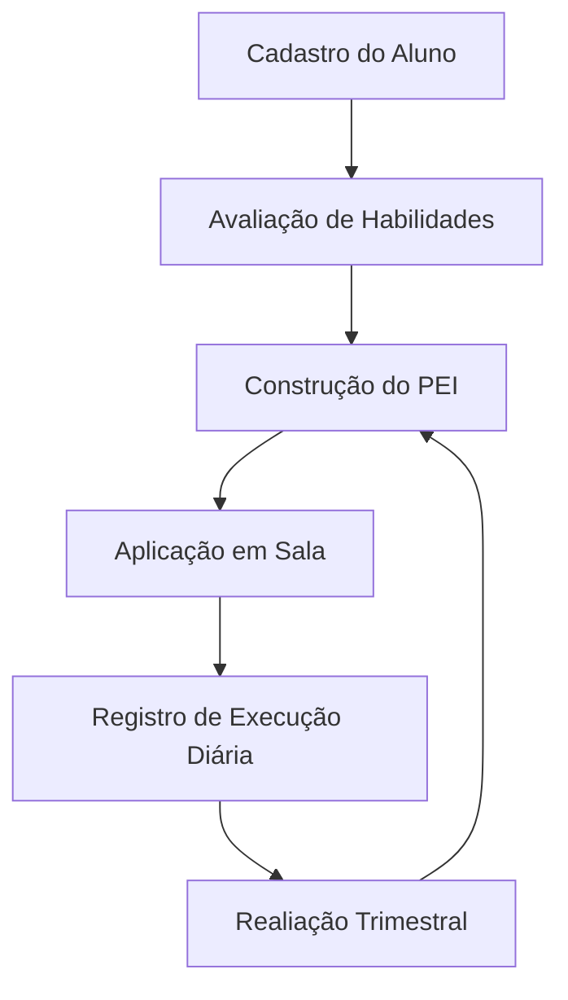

Para utilizar o VínculoTEA com máximo desempenho, é fundamental compreender a filosofia do PEI. 

## O que é o PEI?
O Plano Educacional Individualizado é um documento pedagógico dinâmico que descreve as necessidades, interesses e metas de um aluno com deficiência ou necessidade especial. Ele não é apenas um formulário, mas um compromisso ético e legal da escola com o aluno.

## A Legalidade no Brasil
No contexto brasileiro, o PEI encontra amparo na LBI (Lei Brasileira de Inclusão - Lei 13.146/2015) e em notas técnicas que garantem o Atendimento Educacional Especializado (AEE).

### Por que usar um sistema digital para isso?
1. Transparência: Pais e terapeutas externos têm clareza sobre o trabalho da escola.
2. Continuidade: Se um professor mudar, o próximo herda todo o histórico e estratégias que funcionaram.
3. Prazos: O sistema avisa quando um PEI está prestes a vencer ou precisa de revisão.

## Níveis de Suporte no TEA
O VínculoTEA permite registrar os níveis de suporte do aluno, conforme o DSM-5:
- Nível 1 (Suporte Leve): Exige algum apoio.
- Nível 2 (Suporte Moderado): Exige apoio substancial.
- Nível 3 (Suporte Intenso): Exige apoio muito substancial.

Entender esses níveis ajuda o professor a definir metas realistas no Wizard de Metas da Etapa 5.

## O Ciclo do PEI no VínculoTEA

1. Investigação: Coleta de dados com a família e diagnósticos.
2. Planejamento: Preenchimento do PEI Wizard.
3. Ação: O professor aplica as adaptações curriculares propostas.
4. Monitoramento: Registro de relatos na aba de execução.
5. Revisão: O sistema alerta para a criação de uma nova versão do PEI.
