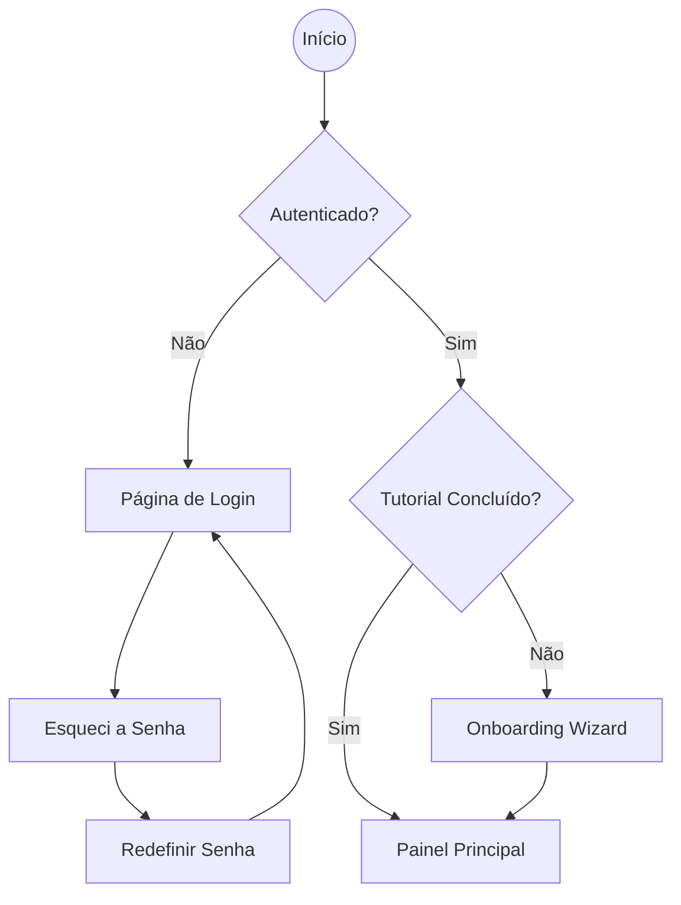
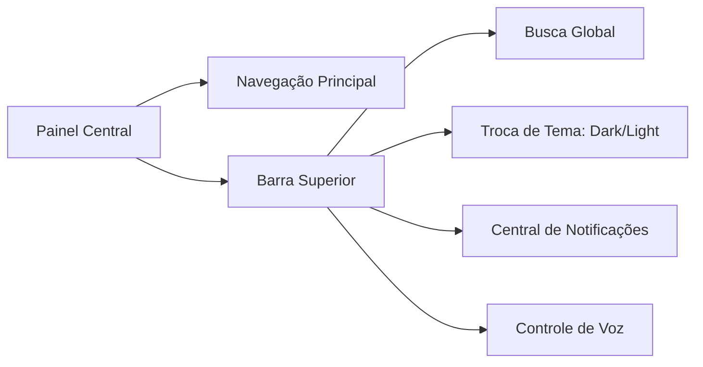
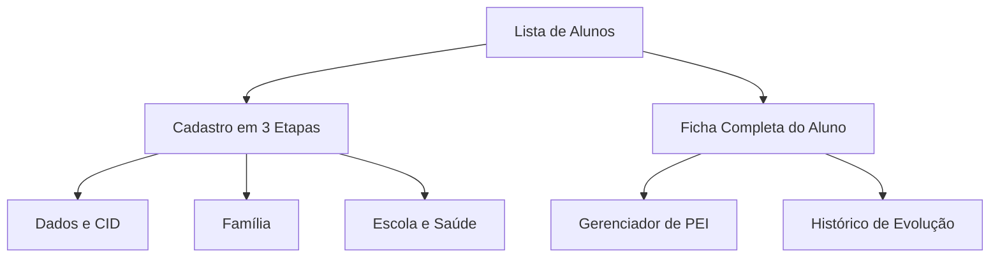
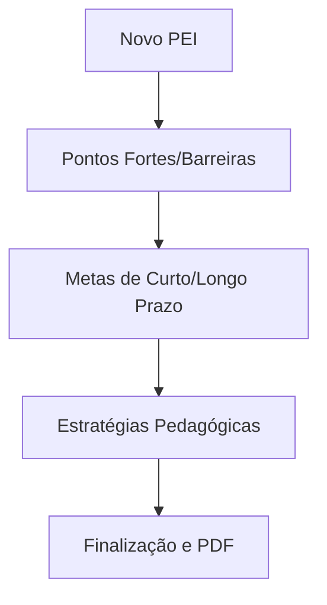
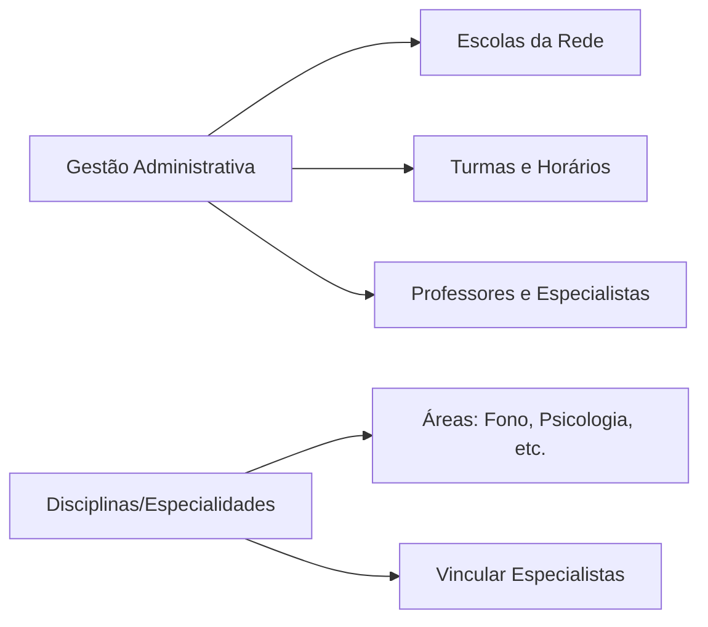
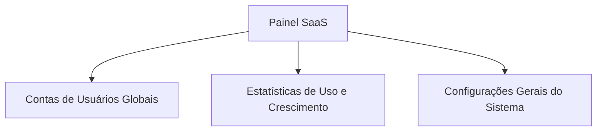
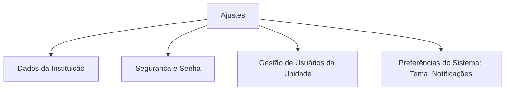

#  Fluxograma e Arquitetura do VínculoTEA

Este documento descreve o fluxo de navegação, funcionalidades principais e a lógica de operação da plataforma **VínculoTEA**.

---

##  1. Fluxo de Autenticação e Primeiros Passos

O acesso à plataforma é controlado pelo Supabase Auth. Novos usuários passam por um fluxo de Onboarding se for o primeiro acesso.

---

##  2. Hub do Dashboard e Recursos de UX

O Painel Central oferece ferramentas de acessibilidade e produtividade.

### ⌨️ Atalhos e Comandos
- **Busca Global**: `Ctrl/Cmd + K` ou `Alt + S`.
- **Controle de Voz**: `Alt + V` (Comandos como "Ir para Alunos", "Pesquisar...").
- **Offline Sync**: Sincronização automática de ações realizadas sem internet.

---

## 🛡️ 3. Hierarquia de Acesso (RBAC)

A visibilidade dos módulos na Sidebar depende das permissões do usuário:

| Permissão | Módulos Acessíveis |
| :--- | :--- |
| **SuperAdmin** | Painel SaaS, Alunos, Gestão, Relatórios, Ajustes |
| **Admin** | Alunos, Gestão, Disciplinas, Relatórios, Ajustes |
| **Profissional** | Alunos (Vinculados), Agenda, Relatórios Básicos |
| **Visualizador** | Dashboards de Consulta, Relatórios de Progresso |

---

## 👨‍🎓 4. Gestão de Alunos, PEI e Disciplinas

### 📝 Cadastro e Acompanhamento

### 📋 Elaboração do PEI (Wizard)

---

## 🏢 5. Gestão de Rede e Especialidades

Módulos para controle da infraestrutura educacional e áreas de atendimento.

---

## 🔐 6. Painel SuperAdmin (SaaS)

Gestão de nível global para administradores da plataforma.

---

## ⚙️ 7. Configurações e Sistema

O módulo de Ajustes permite configurar o comportamento da plataforma para a organização (Multi-tenancy).

---

## 🛠️ Stack Tecnológica de Fluxo
- **Auth**: Supabase Auth (JWT).
- **Database**: PostgreSQL + RLS (Segurança a nível de linha).
- **Frontend**: React + Vite (Lazy Loading para performance).
- **Acessibilidade**: Context API para estados globais de tutorial, tema e voz.
- **Offline**: Service Workers e lógica de sincronização em `offlineService.ts`.
